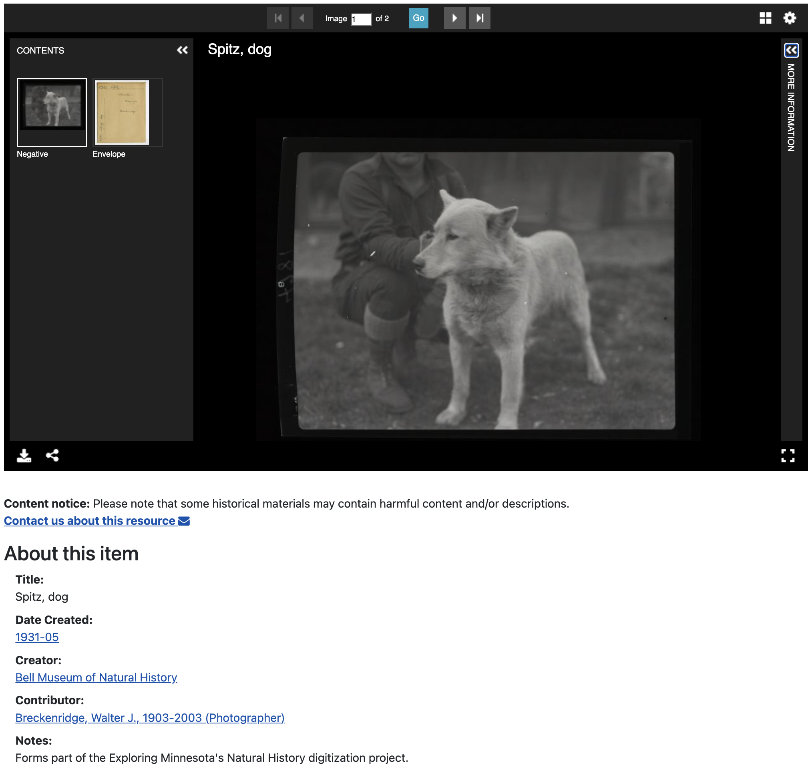

# [Midwest Archives Conference | Minneapolis 2025](https://www.midwestarchives.org/2025-annual-meeting)



This is a static page for the illustrative application of IIIF Manifests and Universal Viewer. This is a resource for the talk, [placeholder](https://midwestarc.memberclicks.net/assets/documents/MeetingPrograms/MAC_SpringProgram_2024_FINAL.pdf).
<hr>

#### Speakers
- Theresa Berger, University of Minnesota, Head of Digital Library Services
- Scott Lawan, University of Minnesota, Libraries Web Applications Developer
<hr>

#### Additional Links
- Link to the demo/example page may be found: [here](https://sourslaw.github.io/mac_ciao/)
- Additional information regarding IIIF may be found: [here](https://iiif.io/)
- Addtional information regarding what the University of Minnesota Libraries is doing with [Blacklight](https://github.com/projectblacklight/blacklight) or IIIF may be directed to: [Lawans@umn.edu](mailto:lawans@umn.edu)

---

This uses UV v3, for v4 examples use https://github.com/UniversalViewer/uv-examples

#### Prerequisites
- [Git](https://git-scm.com/)
- [Node](https://nodejs.org/)

Once these are installed, clone this repository to your file system, then run the following commands in your terminal:

```
cd mac-hello
npm install
npm start
```

Then browse to `localhost:5000`. (You can run the UV on regular port 80, we're just using 5000 to test on localhost).

Video guide: https://youtu.be/wHK5DmMYXZE
